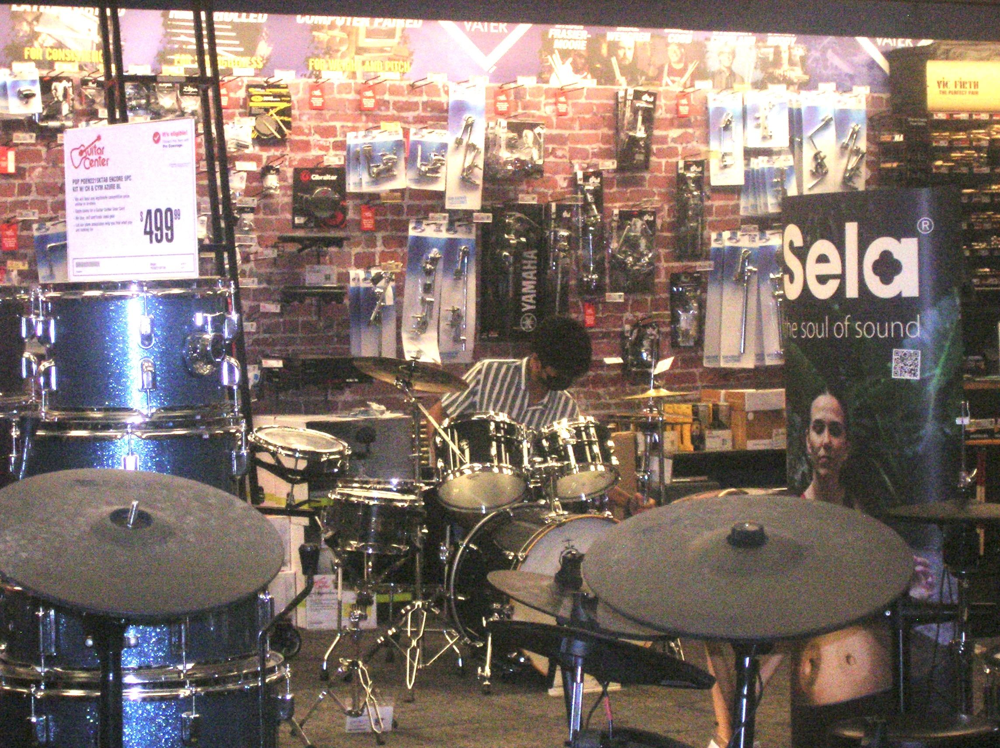

# Hannah's Photo Gallery!
## First Camera
Hello, I'm Hannah and one of my passions is film and photography! For the past few years, I've been focusing more on videography and editing. However this year, I wanted to pursue more photography since I finally have my own camera. Here are some of my favorite pictures that I've taken with my first camera. 

## Old Camera
Over the years, my parents have used different point and shoot cameras. Even though they are outdated, the types of pictures they produce are starting to become more popular again. The pictures that are taken on these cameras provide a more nostalgic feel which is why I also like using these cameras to to capture memories for fun  

